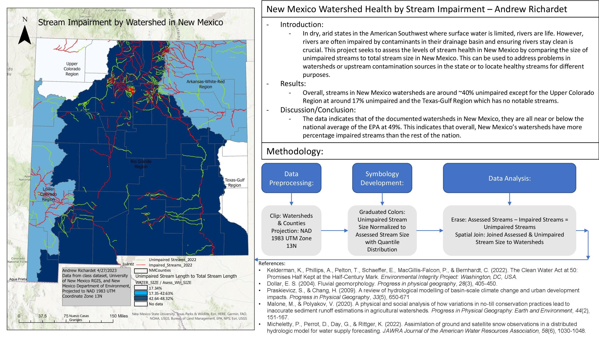

# Andrew Richardet - GIS & Data Science Portfolio

Welcome to my GitHub portfolio! Here, you'll find examples of my work in quantitative hydrology, GIS, and data science, showcasing my skills in Python and spatial analysis.

## About Me

I am a Hydrologist with a strong background in hydrological modeling, spatial data analysis, and data analysis. I leverage my expertise in Python, GIS software (ArcGIS Pro, QGIS), and statistics to solve complex environmental problems.

**Key Skills:**

* Python (Pandas, NumPy, SciPy, GeoPandas, Rasterio, Xarray)
* Geographic Information Systems (ArcGIS, QGIS)
* Watershed Modeling
* Spatial Data Analysis
* Data Visualization

## Featured Projects

### 1. Classifying New Mexico Watershed Health by Stream Impairment

[](flood_risk_analysis/README.md)

* **Description:** An analysis of stream health in New Mexico according to the Clean Water Act.
* **Key Techniques:** GIS cartographic principles.

## Code Samples
**Creating a function to sample water balance components from a NetCDF file in the area of an upstream basin:**
```python
import numpy as np
import pandas as pd
import os
import geopandas as gpd
import xarray as xr
from pathlib import Path
from pyproj import Transformer, Proj, transform, CRS
import shapely
import dataretrieval.nldi as nldi

# File directories
o_dir = Path('../model_files/out')
compare_dir = Path('../comparison_data')
gis_dir = Path( '../model_files/rasters')
data_dir = Path(o_dir)
export_dir = Path('../comparison_data/wb_output_sums')


#get rows, and columns from subset ascii files
asc_lines = open(os.path.join(gis_dir,'AWC_subset.asc'), "r").readlines()
col = int(asc_lines[0].split()[1])
row = int(asc_lines[1].split()[1])
file_extension = f'__1995-01-01_to_1995-12-31__{row}_by_{col}.nc'
model_name = 'michigan_daymet_'

# Reading in water balance netcdf file names
recharge = data_dir / f"{model_name}net_infiltration{file_extension}"
irr = data_dir / f"{model_name}irrigation{file_extension}"
gross_prcp = data_dir / f"{model_name}gross_precipitation{file_extension}"
et = data_dir / f"{model_name}actual_et{file_extension}"
rej_rech = data_dir / f"{model_name}rejected_net_infiltration{file_extension}"
run = data_dir / f"{model_name}runoff{file_extension}"
rain = f"{model_name}rainfall{file_extension}" 

if os.path.exists(Path('../model_files/boundary_files/upstream_basins')):
    pass
else:
    os.mkdir(Path('../model_files/boundary_files/upstream_basins'))
                  

#Obtaining upstream basin shapefile polygons:

site1 = '04117500' #Basin 1
site2 = '04117004' #Basin 2
site3 = '04118000' #Basin 3
sites = [site1, site2, site3]

def get_waterbalance_components(site_id_list):
    x = 1
    for site_id in site_id_list:
        basin = nldi.get_basin(feature_source = 'nwissite', feature_id = f'USGS-{site_id}')
        basin.to_file(Path(f'../model_files/boundary_files/upstream_basins/basin{x}_.shp'))
        x = x+1


    component_list = []
    datum_list = [recharge, irr, gross_prcp, et, rej_rech, run, rain]
    bndry_f = [f for f in os.listdir(os.path.join('..','model_files','boundary_files','upstream_basins')) if f.endswith('basin.shp')]
    for datum in datum_list:
            component = xr.load_dataset(datum, decode_times = True)
            component = component.resample(time = 'M').mean()
            datum = component
            component_list.append(datum)
            
    for bndry_name in bndry_f:
        bndry = gpd.read_file(os.path.join('..','model_files','boundary_files','upstream_basins',bndry_name))
        bndry.to_crs(crs = 'epsg:5070', inplace = True)
        x_grid, y_grid = np.meshgrid(component['x'], component['y'])
        x_coords = x_grid.flatten()
        y_coords = y_grid.flatten()
        grid_centroids_array = [shapely.geometry.Point(x, y) for x, y in zip(x_coords, y_coords)]

        grid_centroids = gpd.GeoDataFrame(geometry = grid_centroids_array)

        grid_centroids_basin = grid_centroids.clip(bndry)
        grid_centroids_basin.reset_index(drop = True, inplace= True)

        # grid_centroids_basin.to_file(os.path.join('..','model_files','boundary_files','upstream_basins','swb_centroids.shp'), index = False)
        
        # grid_centroids_basin = gpd.read_file(os.path.join('..','model_files','boundary_files','upstream_basins','swb_centroids.shp'))
        
        basinwide_component_coord = []
        for coordinate in grid_centroids_basin['geometry']:
            component_at_coord = []
            for component in component_list:
                data_variable = list(component.data_vars)[0]
                        
                value = component[data_variable].loc[component['time'],np.float64(coordinate.y),np.float64(coordinate.x)].values
                value = (value/12)*(10763910.41671) #Converting from inches of wb component to cubic feet
                component_at_coord.append(value)
            basinwide_component_coord.append(component_at_coord)
            
        basinwide_array = np.array(basinwide_component_coord)
        basinwide_array = basinwide_array.sum(axis = 0)
        basinwide_array = np.swapaxes(basinwide_array, 0, 1)

        basin_dataframe = pd.DataFrame(basinwide_array)
        basin_dataframe.columns = ['net_infiltration','irrigation','gross_precipitation','actual_et','rejected_net_infiltration','runoff','rainfall']
        basin_dataframe.insert(0, 'time', pd.Series(component['time']))

        basin_dataframe.to_csv(f'../model_files/{bndry_name.rstrip('.shp')}.csv', index = False)
